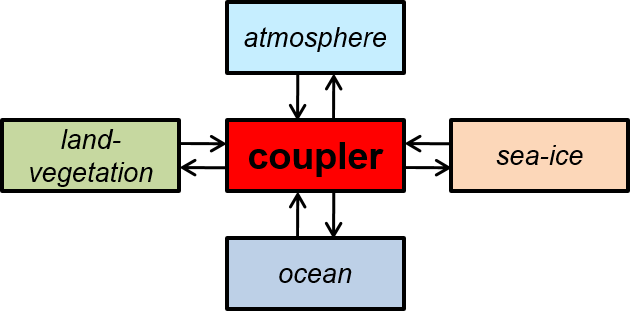

EYRg-wiki
=========

This repository contains all information about the 
_Enlighten Your Reseach global_ (EYRg) part of the _eSalsa_ project.

What is the eSalsa Project?
---------------------------

The eSalsa Project is a cooperation between the [Netherlands eScience Center (NLeSC)](http://www.esciencecenter.nl/), 
the [Institute for Marine and Atmospheric Research (IMAU)](http://imau.nl/) at Utrecht University, and the 
[Vrije Universiteit Amsterdam (VU)](http://www.cs.vu.nl). 

The goal of the eSalsa project is to determine to what extent regional sea 
level in the eastern North Atlantic will be affected by changes in ocean 
circulation over the next decades.

During this project, we will use the [Parallel Ocean Program (POP)](http://climate.lanl.gov/Models/POP/)
and the [Community Earth System Model (CESM)](http://www2.cesm.ucar.edu/) to run climate simulations.

An additional goal of the eSalsa projects is to improve and extend POP with 
support for distributed computing techniques and accelerators (GPUs).

For more information on the eSalsa project see:
 
<http://www.esciencecenter.nl/projects/project-portfolio/climate-research>

What is Enlighten Your Reseach global ?
---------------------------------------

EYRg is a competition organized by five National Research and Education Networks (NRENS), 
ESnet, Funet, Internet2, Janet and SURFnet. The goal of EYRg is to promote the use of 
state-of-the-art networking resources in scientific research. Our proposal 
_"An Advanced Distributed Computing Approach to High-Resolution Climate Modeling"_ is one 
of the winner of this competition.

More information about EYRg can be found at <https://www.enlightenyourresearch.net>

What are we planning to do?
---------------------------

In EYRg, we will use the Community Earth System Model (CESM) to an run 
high-resolution climate simulation _on a combination of supercomputers_.
Our goal is to increase the resolution of the ocean and sea ice components 
of CESM from the current state-of-the-art 0.1 degree (10 km) to a currently 
unfeasible 0.02 degree (2 km). 

This will require at least 25x more processing time for these models, 
although more pessimistic estimates go up to an increase of 100x or 
even more. In our experiments, the resolution of both atmosphere and 
land models will remain unchanged at 0.5 degree (50 km).

When running climate simulations at such extreme resolutions, 
traditional supercomputers often do not have enough processing power 
available for the necessary computations. Fortunately, CESM is a 
multi-component model (as shown below) where the amount of communication
between submodels is limited (at least relatively to the amount of 
communication within each submodel). 

This allows us to distribute the individual models of CESM over multiple 
locations and run our simulations on combinations of supercomputers. 
By connecting these supercomputer with high bandwidth networks (_lightpaths_)
we can ensure that the inter model communication overhead remains acceptable.

Additiona information, HOWTOs, example, ...
-------------------------------------------

Additional information about our project:

[Our EYRg proposal](https://github.com/jmaassen/EYRg-wiki/blob/master/documents/EYRG_Dijkstra_Final.pdf)

[Howto install CESM](http://todo)

[Howto install eSalsa-MPI](http://todo)

[Howto use CESM with eSalsa-MPI](http://todo)

[Results](http://todo)

