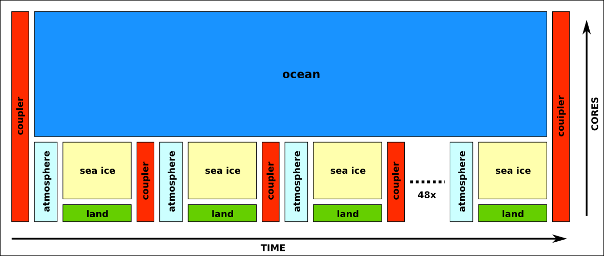
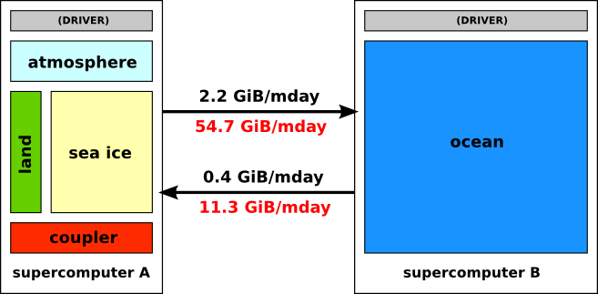
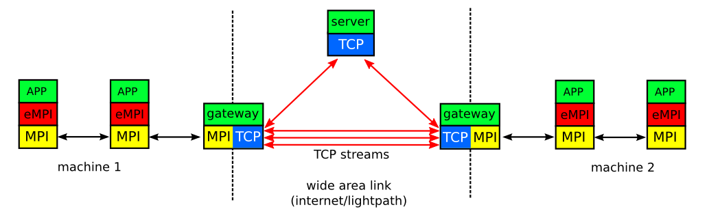

EYRg-wiki
=========

This repository contains all information about the 
_Enlighten Your Reseach global_ (EYRg) part of the _eSalsa_ project.

What is the eSalsa Project?
---------------------------

The eSalsa Project is a cooperation between the 
[Netherlands eScience Center (NLeSC)](http://www.esciencecenter.nl/), 
the [Institute for Marine and Atmospheric Research (IMAU)](http://imau.nl/) 
at Utrecht University, and the [Vrije Universiteit Amsterdam (VU)](http://www.cs.vu.nl). 

The goal of the eSalsa project is to determine to what extent regional sea 
level in the eastern North Atlantic will be affected by changes in ocean 
circulation over the next decades.

During this project, we will use the [Parallel Ocean Program (POP)](http://climate.lanl.gov/Models/POP/)
and the [Community Earth System Model (CESM)](http://www2.cesm.ucar.edu/) to run climate simulations.

An additional goal of the eSalsa projects is to improve and extend POP with 
support for distributed computing techniques and accelerators (GPUs).

For more information on the eSalsa project see:
 
<http://www.esciencecenter.nl/projects/project-portfolio/climate-research>

What is Enlighten Your Reseach global ?
---------------------------------------

EYRg is a competition organized by five National Research and Education Networks (NRENS), 
ESnet, Funet, Internet2, Janet and SURFnet. The goal of EYRg is to promote the use of 
state-of-the-art networking resources in scientific research. Our proposal 
_"An Advanced Distributed Computing Approach to High-Resolution Climate Modeling"_ is one 
of the winner of this competition.

More information about EYRg can be found at:

<https://www.enlightenyourresearch.net>

What are we planning to do?
---------------------------

Our goal in EYRg, is to run a high-resolution climate simulation on a _combination_ of supercomputers. For 
this we will use CESM, a multi-model/multi-kernel simulation consisting of 5 components: atmosphere, ocean, 
land, ice and coupler, as shown in the figure below. The coupler is the component that is responsible for the 
necessary data conversion between the models.

In its current form, the CESM is run on a single supercomputer, typically on ten thousand cores 
or more, although some experiments use up to 200,000 cores. When running a simulation, CESM internally 
divides the available cores over the 5 different models. It is up to the user of CESM to the assign cores to 
each model. Cores may be assigned to a single model, or shared by multiple models.

The amount of processing time required per model depends both on the resolution and the complexity of each 
model. For typical configurations, the ocean model requires by far the most processing time, followed by 
atmosphere and ice. Land only requires a small amount of processing due to its low complexity.

The coupling frequency is the number of times data is exchanged between models per simulated day. For typical 
configurations, data is exchanged between land, ice and atmosphere models every 30 simulated minutes, 
resulting in 48 couplings per simulated day. The ocean model only needs to exchange data with the other 
models a few time times every simulated day (typically one to four times).

Due to data dependencies between the atmosphere model and the land and ice models, these models cannot be run 
concurrently. The resulting workflow for CESM is shown below. This workflow illustrates a single simulated 
day (left to right) for all cores (bottom to top).

During the EYRg experiments, our goal is to increase the resolution of simulations from the current 
state-of-the-art 0.1 degree (10 km) ocean+sea ices and 0.5 degree (50 km) atmosphere+land to a currently 
unfeasible 0.02 degree ocean+sea ice and 0.5 degree atmosphere+land. This will require at least 25x more 
processing time for the ocean model, although more pessimistic estimates go up to an increase of 100x or even 
more.

When running climate simulations at such extreme resolutions, traditional supercomputers often do not have 
enough processing power _available_ for the necessary computations. Fortunately, in CESM, the amount of 
communication between submodels is limited (at least compared to the amount of communication within each
submodel). This allows us to distibuted the models over multiple locations. Taking coupling frequencies 
and data dependencies into account, we can easily distribute the models as follows:

Since the ocean model is relatively loosely coupled to the other models, it can be run on a separate 
supercomputer, provided the communication channel between the supercomputers is fast enough for the 
data exchanges that are required each model day. The black numbers between the models are an estimate of 
the amount of data that needs to be exchanged between models during a _single_ model coupling when using 
0.5/0.1 degree resolutions. The red numbers are an estimate for the amount of data exchanged when using 
the 0.5/0.02 degree resolution.

The lightpaths provided by the NRENs that organized EYRg typically offer a bandwith of 10Gbit/s or more. 
We think that this should be sufficient for our initial experiments. 

How are we planning to do it? 
-----------------------------

Our aim is to run our distributed computing experiments with out changing a single line of the CESM 
code. Since CESM is a Fortran/MPI application, the obvious choice is therefore to use an MPI that 
is capable of utilizing both the fast local interconnects of the supercomputers, and the lightpath 
connection between the machines. 

Since we were not able to find an existing MPI implementation that suited our needs (there are lot of 
technical details that need to be taken into account here), we decided to grow our own:
[eSalsa-MPI](https://github.com/NLeSC/eSalsa-MPI/tree/develop).

eSalsa-MPI consists of three components, an MPI wrapper, gateways and a server, as shown in the example 
below:

The _wrapper_ implements (part of) the regular MPI interface. This allows applications to be compiled 
against, and linked with, eSalsa-MPI instead of a "normal" MPI implementation. This way, all MPI calls 
performed by the application are intercepted by eSalsa-MPI.

The _server_ acts as a central contact point that allows the eSalsa-MPI jobs running on different 
supercomputers to locate each other. In addition, the server provides support for operations on communicators 
and groups. For example, it is up to the server to create an MPI_COMM_WORLD communicator that contains all 
tasks on all particiating machines.

It is the tasks of the _gateways_ to forward (local) MPI messages over the wide area links and vice versa. To 
do so, a gateway is connected to a peer gateway in a remote site via one or more TCP streams. Each site may 
use multiple gateways.

eSalsa-MPI is __not__ a complete MPI implementation. Instead, most MPI calls are simple forwarded to 
the local MPI implementation, using the MPI profiling interface. Only MPI calls that require wide area 
communication are handled differently. 

For each MPI call intercepted by eSalsa-MPI a decision is made if the call can be handled locally (for 
example, an MPI_Send to a different process in the same cluster) or if it must be forwarded to a local 
gateway that will forward it to a remote site (for example an MPI_Send between clusters or a collective 
operation that involves all processes).

By using eSalsa-MPI, traditional MPI applications to be run on a -combination- of multiple supercomputers or 
clusters, without changing a single line of code in the application. eSalsa-MPI "merges" multiple distict MPI 
jobs running on different supercomputers and present it to the application a a single set of MPI tasks. This 
way, the application "thinks" it is running on a single supercomputer, while in reality it it running on two 
or more.

More information about eSalsa-MPI can be found here:

<https://github.com/NLeSC/eSalsa-MPI/tree/develop>

More information, HOWTOs, examples, ...
-------------------------------------------

- Our EYRg proposal: [(pdf)](https://github.com/jmaassen/EYRg-wiki/blob/master/documents/EYRG_Dijkstra_Final.pdf?raw=true)

- Initial network topology provided by SURFnet: [(pdf)](https://github.com/jmaassen/EYRg-wiki/blob/master/documents/Network\ topology\ Dijkstra\ project\ EYR\ Global_v1.pdf?raw=true)

- Initial planning: [(pdf)](https://github.com/jmaassen/EYRg-wiki/blob/master/documents/Planning.pdf)

- Short HOWTO: [Installing CESM](https://github.com/jmaassen/EYRg-wiki/blob/master/howtos/CESM.md)

- Short HOWTO: [Installing eSalsa-MPI](https://github.com/jmaassen/EYRg-wiki/blob/master/howtos/eSalsaMPI.md)

- Short HOWTO: [Using eSalsa-MPI in CESM](https://github.com/jmaassen/EYRg-wiki/blob/master/howtos/CESM_eSalsaMPI.md)

- Initial experimental [results](https://github.com/jmaassen/EYRg-wiki/blob/master/results/results.md)

