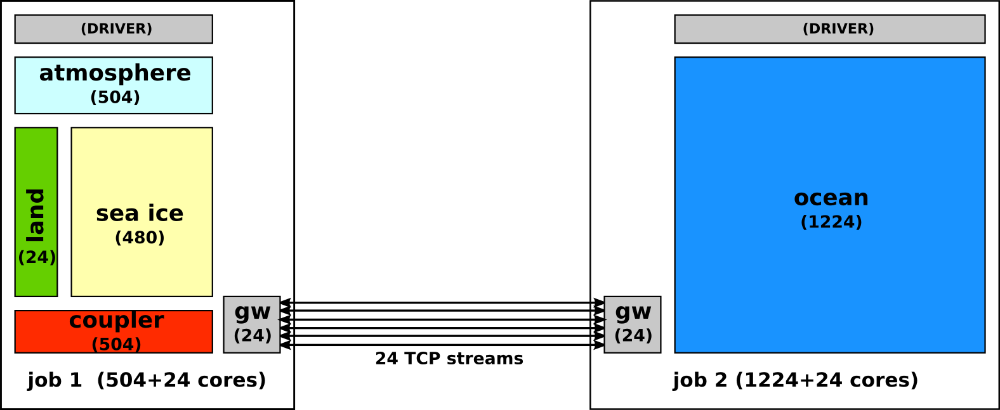

HOWTO: Running CESM with eSalsa-MPI
===================================

We will now give a description of how to run CESM using eSalsa-MPI. 
We assume you already have compiled a CESM using eSalsa-MPI. 
If not, go though this howto first:

<https://github.com/jmaassen/EYRg-wiki/blob/master/howtos/CESM_eSalsaMPI.md>

# Prepare the eSalsa-MPI configuration

Once the experiment has compiled succesfully we need to create the necessary eSalsa-MPI configuration files 
to run it. We assume the 1728 core configuration descibed 
[here](https://github.com/jmaassen/EYRg-wiki/blob/master/howtos/CESM_eSalsaMPI.md) is used, and that CESM 
will be split in two jobs:

- 504 cores running the atmosphere, land, sea ice and coupler
- 1224 cores running the ocean.

In addition, we will use 2 gateway nodes of 24 cores each. This give us the configuration shown below:

### Prepare the eSalsa-MPI server config

We will now prepare an eSalsa server config as descibed [here](). In this config we descibe the setup
of the server and both CESM jobs:

     # Name of this experiment
     EYRg experiment 1

     # Port at which the server should listnen.
     6677

     # Number of cluster used in this experiment
     2

     # Number of gateways used per cluster
     24

     # Number of streams used to connect gateways
     1

     ##########################################
     # Next, we configure each of the CESM jobs.

     # ATM partition
     job-ATM
     504
     12000
     10.200.0.0/16

     # OCN partition
     job-OCN
     1224
     14000
     10.200.0.0/16

The server is configured to listnen on port 6677. The machine that the server is running on should be
accessible to the gateway nodes of both jobs. The jobs are called "job-ATM" and "job-OCN" and are configured
to use 24 gateways (1 node) per job. For "job-ATM" the gateways will use the network interface with address
`10.200.0.0/16` and port range `12000...12023`. For "job-OCN" the gateways will use the network interface
with address `10.200.0.0/16` and port range `14000...14023`.
Next, two configuration files are needed to configure each CESM job:

The configuration for "job-ATM":

     job-ATM 10.200.200.15 6677

The configuration for "job-OCN":

     job-OCN 10.200.200.15 6677

Both configuration files contain only a single line consisting of the name of the job and the location and
port of the server.

The configuration files are available here:

- [server.config]()
- [job-atm.config]()
- [job-ocn.config]()

### Prepare the submit scripts

Next, we need to create two submit scripts, one for each job. The exact syntax of these scripts depends on the 
resource manager used in the locations at which the jobs are submitted. Here's an example for "job-ATM" 
using SLURM:

     #!/bin/tcsh -f
     #
     # Slurm job description that starts a job on 21+1 nodes.
     #
     # This run consists of 21 nodes running the ATM/LND/CICE and CPL, 
     # and 1 node running the gateways.
     #
     
     #SBATCH --time=03:00:00 
     #SBATCH -N 22
     #SBATCH -p normal
     #SBATCH --ntasks-per-node=24
     #SBATCH --job-name=job-atm
     
     #-----------------------------------------------------------------------
     # Determine necessary environment variables
     #-----------------------------------------------------------------------
     
     cd /home/jason/CESM/experiments/test_eyrg
      
     ./Tools/ccsm_check_lockedfiles || exit -1
     source ./Tools/ccsm_getenv || exit -2
     
     if ($BUILD_COMPLETE != "TRUE") then
       echo "BUILD_COMPLETE is not TRUE"
       echo "Please rebuild the model interactively via"
       echo "   ./${CASE}.${MACH}.build"
       exit -2
     endif

     #-----------------------------------------------------------------------
     # Determine time-stamp/file-ID string
     # Clean up previous run timing files
     #-----------------------------------------------------------------------

     setenv LID "`date +%y%m%d-%H%M%S`"
     env | egrep '(MP_|LOADL|XLS|FPE|DSM|OMP|MPC)' # document env vars
     
     # -------------------------------------------------------------------------
     # Build the namelists and check prestage
     # -------------------------------------------------------------------------

     cd $CASEROOT
     source $CASETOOLS/ccsm_buildnml.csh || exit -3
     cd $CASEROOT
     source $CASETOOLS/ccsm_prestage.csh || exit -3
     
     # -------------------------------------------------------------------------
     # Create and cleanup the timing directories
     # -------------------------------------------------------------------------
     
     if (-d $RUNDIR/timing) rm -r -f $RUNDIR/timing
     mkdir $RUNDIR/timing
     mkdir $RUNDIR/timing/checkpoints
     
     set sdate = `date +"%Y-%m-%d %H:%M:%S"`
     echo "run started $sdate" >>& $CASEROOT/CaseStatus
     
     # -------------------------------------------------------------------------
     # Run the model
     # -------------------------------------------------------------------------
     
     sleep 25
     cd $RUNDIR
     echo "`date` -- CSM EXECUTION BEGINS HERE" 
     
     #===============================================================================
     # GENERIC_USER
     # Launch the job here.  Some samples are commented out below
     #===============================================================================

     # Start the job-ATM
     setenv EMPI_CONFIG /home/jason/CESM/experiments/test_eyrg/job-atm.config
     srun ./ccsm.exe >& ccsm.ATM.log.$LID
     
     wait
     echo "`date` -- CSM EXECUTION HAS FINISHED" 
     
     cd $CASEROOT
     ./Tools/ccsm_postrun.csh || exit 1

Important thing to notice in this example are:

  - This script requests 22 nodes of 24 cores each. Adapt this to the node and core count of the target machine.

  - The script changes directories twice. Once to `cd /home/jason/CESM/experiments/test_eyrg` and then to 
    ` cd /home/jason/CESM/experiments/test_eyrg/build`. Adapt this to your own configuration. 

  - This script sets an environment variable `EMPI_CONFIG` to the location of the eSalsa-MPI configuration 
    file for the "job-ATM" job: `/home/jason/CESM/experiments/test_eyrg/job-atm.config`. Make sure that you 
    set this variable, and that the config file exists. eSalsa-MPI needs this config file to find the server.

The examples submit scripts are available here: 
[submit-atm-528.slurm](https://github.com/jmaassen/EYRg-wiki/blob/master/configs/cartesius-1m/submit-atm-528.slurm) 
and 
[submit-ocn-1248.slurm](https://github.com/jmaassen/EYRg-wiki/blob/master/configs/cartesius-1m/submit-ocn-1248.slurm).

### Start the server and submit the jobs. 

Once all confguration files have been created, you can start a job by performing these steps:

_Start the server:_

     $EMPI_HOME/scripts/empi-server.sh server.config

It should then print something like this:

     0 : Logging started
     5 : Starting eSalsa MPI server for experiment "EYRg experiment 1"
     5 :    Clusters                 : 2
     5 :    Gateways/clusters        : 24
     5 :    Application processes    : 1728
     5 :    Total processes          : 1776
     5 :    Parallel streams         : 1
     5 :    Server listening on port : 6677
     5 :    --------------------------
     5 :    Cluster 0 name           : "job-ATM"
     5 :       Application processes : 504
     5 :       Port range in use     : 12000 ... 12024
     5 :       Network to use        : 10.200.0.0/255.255.0.0
     5 :    --------------------------
     5 :    Cluster 1 name           : "job-OCN"
     5 :       Application processes : 1224
     5 :       Port range in use     : 14000 ... 14024
     5 :       Network to use        : 10.200.0.0/255.255.0.0
     6 : 
     6 : Waiting for 2 clusters to connect...

_Submit the jobs:_

     sbatch submit-atm-528.slurm

and 

     sbatch submit-ocn-1248.slurm

Once the jobs are started by the resource manager and have contacted the server, the server will produce output like this:

     620779 : Got connection from Socket[addr=/10.200.202.125,port=43114,localport=6677]
     620780 : Cluster job-ATM connected to gateway at Socket[addr=/10.200.202.125,port=43114,localport=6677]
     620781 : Receiving gateway info for gateway job-ATM/0
     620914 :   Available IP address: /10.2.202.125
     620914 :   Available IP address: /10.200.202.125
     620914 :   Available IP address: /10.201.202.125

     ....

     680563 : Got connection from Socket[addr=/10.200.203.9,port=46093,localport=6677]
     680563 : Cluster job-OCN connected to gateway at Socket[addr=/10.200.203.9,port=46093,localport=6677]
     680563 : Receiving gateway info for gateway job-OCN/0
     681727 :   Available IP address: /10.2.203.9
     681727 :   Available IP address: /10.200.203.9
     681727 :   Available IP address: /10.201.203.9

     ... 
     
     682565 : Signup complete -- all clusters are connected!
     682565 : Creating communicator 0 with 1728 processes
     682573 : Server waiting until application terminates.
 
     ...

     684913 : Creating new group from communicator 0
     684925 : Created new communicator: COMM(3) = [ 0:0, 0:1, 0:2, .... ]
   
     ...

     etc.

These are the gateway processes for each of the jobs signing up at the server. Once all gateways are running, 
the server will create an global communicator (MPI_COMM_WORLD) containing all _application_ processes (1728
in this case). The server prints some logging information whenever the application creates a new communicator.

Note that the server is only used by the gateway processes of the jobs to exchange contact information, and by the 
application processes when communicators created. Otherwise the server remains idle and should not consume 
any CPU time.

 

 

